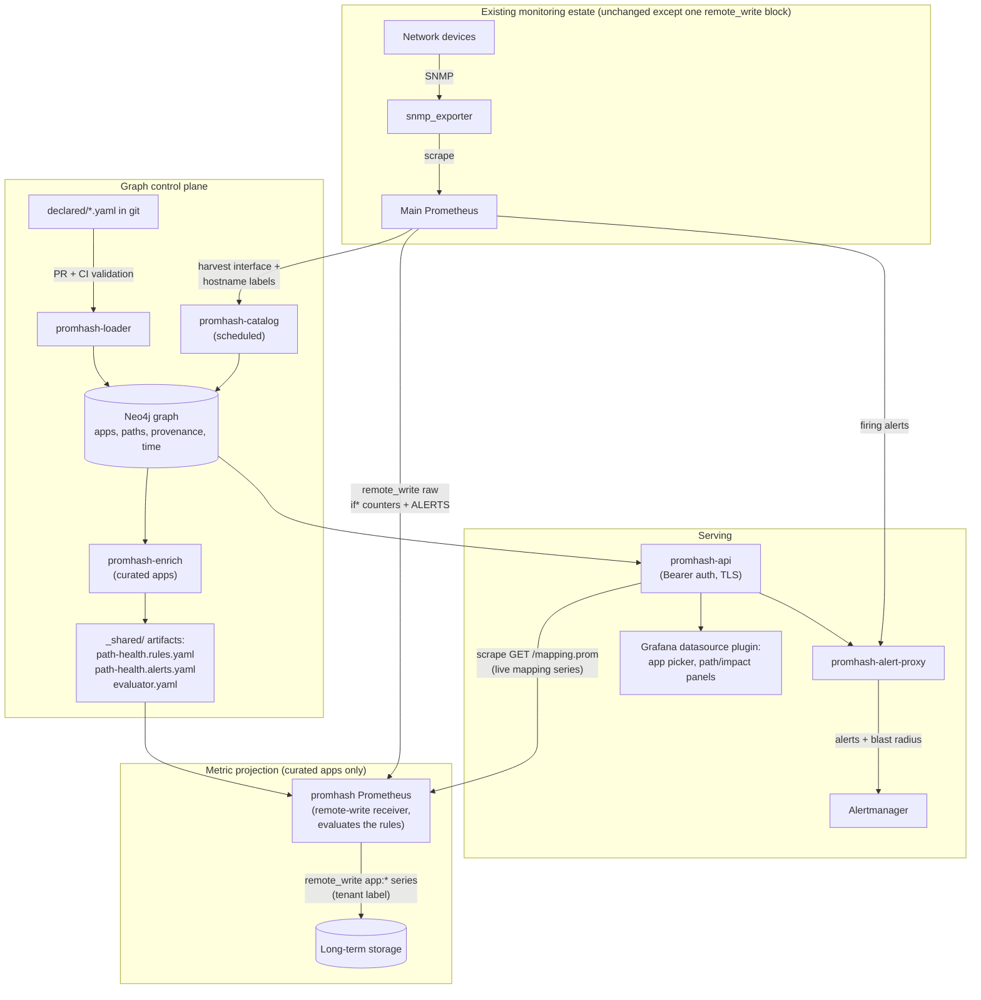

# promhash

Maps network and infrastructure metrics to the business applications that depend on them, without adding an `app` label to a single infrastructure time series.

promhash bridges three datasets that rarely share a reliable key: the application knowledge engineering teams hold (declared as YAML in git), network telemetry, and the infrastructure time series in Prometheus (`snmp_exporter`, `blackbox_exporter`, `node_exporter`). It stores the application-to-infrastructure relationship in a property graph and uses that graph to answer two questions cheaply:

- **App path health.** Given an application, which devices and interfaces does its traffic cross, and are any of them saturated or down?
- **Impact / blast radius.** This interface or device just failed; which applications and customers are affected?

The infrastructure metrics are never tagged with an `app` label. The relationship lives in the graph and is projected into Prometheus only where it is needed.

---

## Contents

- [Why this exists](#why-this-exists)
- [How it works](#how-it-works)
- [Quickstart](#quickstart)
- [Data model](#data-model)
- [Requirements](#requirements)
- [Declaring application paths](#declaring-application-paths)
- [Command-line tools](#command-line-tools)
- [HTTP API](#http-api)
- [Alert enrichment proxy](#alert-enrichment-proxy)
- [Grafana datasource plugin](#grafana-datasource-plugin)
- [Enrichment and projection](#enrichment-and-projection)
- [How-to recipes](#how-to-recipes)
- [Codebase reference](#codebase-reference)
- [Development](#development)
- [Design principles](#design-principles)
- [Known v1 simplifications](#known-v1-simplifications)
- [Roadmap](#roadmap)

---

## Why this exists

A network interface is shared. A single `ifHCInOctets{instance="rtr-core-1",ifIndex="42"}` series carries traffic for many applications and customers at once. That breaks the obvious approaches:

- A single `app` label on a shared interface is wrong: there is no single application. The relationship is many-to-many.
- One series per `(interface, app)` pair is a cardinality explosion across thousands of devices.
- Flow data does not cover everything: high-fidelity flow records typically exist in the core, not at every edge or office site.

promhash keeps the many-to-many relationship in a graph, where it belongs, and shards any per-application time series by application so the working set stays small. Recording rules that were unaffordable against the full firehose become trivial when scoped to a single application's path.

---

## How it works



The lifecycle, in order:

1. **Sync.** `promhash-catalog` runs on a schedule and harvests the real interface inventory (`ifName`, `ifDescr`, `ifAlias`, `ifIndex`) plus the `hostname` target label from the main Prometheus into Neo4j.
2. **Declare.** Engineers describe an application's network path as YAML in git. A pull request triggers `promhash-loader -validate-only`, which resolves every device/interface reference against the catalog. Typos fail the PR.
3. **Load.** On merge, `promhash-loader` writes the declaration into the graph with the commit SHA as provenance, closing the previous validity interval and opening a new one.
4. **Query.** `promhash-api` answers path, interface, and impact questions for every application at zero Prometheus cost. The Grafana plugin and the alert proxy are its consumers.
5. **Enrich.** For the curated application set, `promhash-enrich` generates three GitOps artifacts under `_shared/`: the recording rules, the alerting rules, and the promhash Prometheus config. The mapping series itself is not a file; it is served live by `promhash-api` (see step 6), so only reviewable configuration travels through GitOps.
6. **Project.** The main Prometheus remote-writes the raw `if*` counters (and `ALERTS`) to a dedicated promhash Prometheus, which scrapes the bounded mapping series live from `promhash-api` and evaluates the path-health rules once for all curated apps.
7. **Serve.** The resulting `app:if_*` and `app:path_*` series are remote-written onward to long-term storage with a `tenant` label, ready for `sum by(app)`, SLOs, and alerting.

Two layers sit on top of the graph:

1. **The graph (always on).** Identity-resolved nodes for applications, services, customers, devices, interfaces and IPs, joined by directional connections and ordered paths. Every fact carries provenance and a validity interval. This answers impact and path queries for every application, including the parts of the network with no flow coverage.
2. **Per-application projection (opt-in, curated).** For applications that need real metrics (`sum by(app)`, SLOs, alerting), the enrichment generator emits the three shared GitOps artifacts described above, and the bounded mapping series is scraped live from the API. The main Prometheus stays untouched apart from one `remote_write` block.

The heavy infrastructure metrics keep their existing, bounded cardinality. Application context is either a graph lookup (free) or a small, intentional set of derived series.

---

## Quickstart

### Option A: the demo (one command)

A self-contained compose stack under [`demo/`](demo/) runs the entire pipeline against a synthetic three-router topology: moving counters, a near-saturated trunk, and a flapping interface that exercises alert enrichment end to end. No real devices, no Nautobot.

```bash
cd demo && docker compose up -d --build    # podman compose works too
```

Then:

| Where | What |
|---|---|
| http://localhost:9091 | query `app:path_util_max:ratio` or `app:path_hops_down:count` |
| http://localhost:9093 | during a flap window (first 90s of every 10 minutes), the `InterfaceDown` alert arrives with the affected apps and customers attached |
| http://localhost:8080 | `curl -H 'Authorization: Bearer demo-token' localhost:8080/apps` |
| http://localhost:7474 | the graph itself (neo4j / demopass) |

See [`demo/README.md`](demo/README.md) for the full tour.

### Option B: manual setup

This walks an application from a YAML declaration to a queryable path, using a local Neo4j.

```bash
# 1. Build the binaries
make build          # or: go build ./...

# 2. Start a graph (any Neo4j 5 works; here, a throwaway container)
docker run -d --name neo4j -p7687:7687 -p7474:7474 \
  -e NEO4J_AUTH=neo4j/changeme neo4j:5.23

# Secrets come from the environment (NEO4J_PASS / NAUTOBOT_TOKEN).
# Never pass them as flags.
export NEO=bolt://localhost:7687
export NEO4J_PASS=changeme

# 3. Sync the interface catalog from the main Prometheus. Device names come
#    from the hostname label your file_sd target files stamp on every target.
./promhash-catalog -neo4j $NEO \
  -prometheus http://prometheus:9090 \
  -device-label hostname \
  -vendor cisco

# 4. Write a declaration (see "Declaring application paths") into
#    ./declared/payments.yaml, then validate it (CI runs this on every PR)
./promhash-loader -dir ./declared -neo4j $NEO -validate-only

# 5. Load it into the graph
./promhash-loader -dir ./declared -neo4j $NEO -source "$(git rev-parse HEAD)"

# 6. Generate the projection artifacts for curated apps. The promhash
#    Prometheus receives the raw counters via remote_write from the main
#    Prometheus (see "Enrichment and projection").
./promhash-enrich -neo4j $NEO -apps payments -out ./gitops/enrichment \
  -promhash-api promhash-api:8080 \
  -api-token-file /etc/promhash/api-token \
  -remote-write-url http://mimir:9090/api/v1/push \
  -tenant-label prod

# 7. Serve the graph. The API requires a Bearer token (fail-closed); for a
#    quick local run, set one in the environment:
export PROMHASH_API_TOKENS=dev-token
./promhash-api -neo4j $NEO -addr :8080 &

# 8. Ask the questions
AUTH='Authorization: Bearer dev-token'
curl -s -H "$AUTH" localhost:8080/apps
curl -s -H "$AUTH" localhost:8080/apps/payments/path | jq
curl -s -H "$AUTH" localhost:8080/apps/payments/ifaces | jq
curl -s -H "$AUTH" "localhost:8080/impact?device=rtr-core-1&ifName=tengige0/1/2" | jq
```

Seeding application stubs from ServiceNow (`promhash-seed`) is a planned later feature. v1 creates all application and service nodes from the YAML declarations themselves.

---

## Data model

The graph is a property graph (Neo4j). Every node carries a deterministic identity hash (`phash`) so the same entity, seen as an IP, an FQDN, a CMDB sys_id, a serial number, or an inventory id, collapses to one node instead of forking the graph.

**Business layer**

```
(:Customer)-[:CONSUMES]->(:BusinessService)
(:BusinessService)-[:REALIZED_BY]->(:ApplicationService)
(:Application)-[:RUNS_AS]->(:ApplicationService)
```

**Connectivity layer** (reified, directional)

```
(:ApplicationService)-[:USES|:EXPOSES]->(:Endpoint)
(:Connection)-[:FROM]->(:Endpoint)        // client / source
(:Connection)-[:TO]->(:Endpoint)          // server / destination
(:ApplicationService)-[:DEPENDS_ON]->(:ApplicationService)
```

**Physical-path layer** (ordered; the anchor for path health)

```
(:Connection)-[:TAKES]->(:Path)           // one connection may take many CANDIDATE paths
(:Path)-[:HOP {seq, direction}]->(:Interface)
(:Interface)-[:ON]->(:Device)
```

Three decisions shape the whole system:

- **Interfaces are keyed by `(device, canonical ifName)`**, not by `ifIndex`. `ifIndex` renumbers on reconfiguration and is stored as a refreshable attribute, resolved to its current value when rules are generated.
- **Multiple candidate paths.** ECMP, multihop and alternate routing are modelled as several candidate `Path`s under one `Connection`. Which path is active, and its weight, are runtime facts that are not declared; they are filled in later from flow data.
- **Provenance and time on every fact.** Each edge carries `{provenance, confidence, source, valid_from, valid_to}`. The current state is everything with `valid_to` unset. A point-in-time query filters the interval, so you can ask who was affected last Tuesday.

---

## Requirements

| Component | Needed for | Notes |
|-----------|-----------|-------|
| Go 1.26+ | Building everything | Single static binaries |
| Neo4j 5 | The graph store | Memgraph also works (both speak Cypher) |
| Prometheus (main) | Interface catalog + raw counter source | The existing estate; must expose `ifHC*Octets` with `ifName`/`ifDescr`/`ifAlias`/`ifIndex` labels. Untouched except one `remote_write` block |
| Prometheus (promhash) | Rule evaluation for curated apps | A small dedicated instance started with `--web.enable-remote-write-receiver`; receives the raw counters from the main Prometheus |
| Nautobot | Optional fallback | `instance` to device-name mapping, only for targets that carry no hostname-style label; unnecessary when `file_sd` target files stamp a `hostname` label |
| ServiceNow | Planned (later feature) | CMDB seeding of applications and services; not needed for v1, declarations in git are the source |
| Grafana 10.4+ | The datasource plugin | Enterprise supported |
| Docker or Podman | Demo and integration tests | The test suite spins up throwaway Neo4j containers |

---

## Declaring application paths

Application paths are declared as YAML in a git repository. The git history is the record of declared facts: a pull request is a data review, and the commit SHA becomes the provenance `source`. A declaration is intentionally small; the loader expands it into the full graph model.

```yaml
# declared/payments.yaml
app: payments                 # -> (:Application)
runs_as: payments-api         # -> (:ApplicationService), RUNS_AS
owner: team-payments
criticality: tier-1           # free-form; surfaced in impact results

consumed_by_customers:        # -> (:Customer)-CONSUMES->(:BusinessService)-REALIZED_BY->payments-api
  - acme
  - globex

depends_on:                   # each entry -> DEPENDS_ON + a (:Connection) with candidate (:Path)s
  - to: ledger-api
    paths:                    # candidate set; no active/standby, no weight (those are runtime facts)
      - hops:
          - {device: rtr-acc-fra-1, if: Te0/1/2,            direction: egress}
          - {device: rtr-core-1,    if: "uplink-ledger-dc", direction: transit}   # matched by ifAlias
          - {device: rtr-dc-ledger, if: Te1/0/4,            direction: ingress}
      - hops:                 # an alternate / ECMP-member candidate
          - {device: rtr-acc-fra-1, if: Te0/1/2, direction: egress}
          - {device: rtr-core-2,    if: Te0/2/1, direction: transit}
          - {device: rtr-dc-ledger, if: Te1/0/4, direction: ingress}

  - to: auth-api
    path:                     # `path:` is shorthand for a single-candidate `paths:` list
      hops:
        - {device: rtr-acc-fra-1, if: Te0/1/2, direction: egress}
        - {device: fw-dmz-1,      if: eth2,    direction: transit}
        - {device: rtr-dc-auth,   if: Te0/0/1, direction: ingress}
```

Field reference:

| Field | Meaning |
|-------|---------|
| `app` | Business application name. |
| `runs_as` | The application service that actually carries traffic. |
| `owner` | Owning team; surfaced in impact results. |
| `criticality` | Free-form business criticality (e.g. `tier-1`); surfaced in impact results. Optional. |
| `consumed_by_customers` | Customers/tenants that consume the application; gives the customer dimension in impact. |
| `depends_on[].to` | A downstream application service this one talks to (east-west dependency). |
| `depends_on[].paths[].hops[]` | An ordered list of hops for one candidate path. |
| `hop.device` | Device name (must resolve via the catalog). |
| `hop.if` | A human interface reference. Matched against the real `ifName`, `ifDescr`, or `ifAlias` in Prometheus, in any vendor syntax (`Gi0/3`, `GigabitEthernet0/3`, `ge-0/0/3`, or an alias such as `uplink-ledger-dc`). |
| `hop.direction` | `egress`, `transit`, or `ingress`, relative to traffic flow. Selects `ifHCOutOctets` vs `ifHCInOctets` during enrichment. |

Interface references are validated against reality. On a pull request, `promhash-loader -validate-only` resolves every `device`/`if` pair against the catalog (which is harvested from live Prometheus metrics). An unknown or ambiguous reference fails the check with a "did you mean" suggestion list, so a broken declaration never reaches the graph. Removing an entry from the YAML closes its validity interval rather than hard-deleting it, preserving point-in-time history.

---

## Command-line tools

All tools share the Neo4j connection flags `-neo4j` and `-neo4j-user`.

**Secrets.** To keep credentials out of process listings, each tool reads its secret from the environment: `NEO4J_PASS` (all tools), `NAUTOBOT_TOKEN` (`promhash-catalog`), `SERVICENOW_PASS` (`promhash-seed`), `PROMHASH_API_TOKENS` (`promhash-api`, the accepted Bearer tokens), and `PROMHASH_API_TOKEN` (`promhash-alert-proxy`, the token it presents). Always use the environment variables; never pass secrets as flags.

### `promhash-catalog`: build the interface catalog

Harvests the real interface inventory from Prometheus, upserting `Interface` nodes that carry the actual metric labels and current `ifIndex`. This is the normalization layer that lets declarations use human interface names. Run it on a schedule.

Device names come from the `-device-label` series label (default `hostname`, the label your `file_sd` target files stamp on every target). Precedence per interface: device label first, then the optional Nautobot instance-to-device map, then the raw `instance` value as a last resort. Nautobot is an optional naming fallback for environments whose targets carry no hostname-style label.

```
-prometheus      Prometheus base URL                 (default http://localhost:9090)
-device-label    series label carrying the device name  (default hostname; empty disables)
-nautobot        Nautobot base URL                   (optional fallback; instance<->device mapping)
-vendor          default vendor for name canonicalization  (default cisco)
```

Nautobot authentication token: set `NAUTOBOT_TOKEN` in the environment.

### `promhash-seed`: import typed nodes from ServiceNow (later feature)

One-shot import of application and application-service node stubs from a ServiceNow CMDB. This is a preview of a planned integration and is not part of the v1 workflow: declarations in git create all application/service nodes themselves, and a seeded stub is only ever enriched, never required.

```
-servicenow       ServiceNow base URL
-servicenow-user  username
```

ServiceNow password: set `SERVICENOW_PASS` in the environment.

### `promhash-loader`: validate and load declarations

Reads every `*.yaml` in a directory, resolves interface references, and loads the declarations into the graph. Use `-validate-only` as a CI gate.

```
-dir            directory of declaration YAML files  (default declared)
-source         provenance source, e.g. the git SHA  (default manual)
-validate-only  validate against the catalog and exit non-zero on any error; write nothing
```

### `promhash-enrich`: generate GitOps artifacts for curated apps

For each named application, verifies a path exists in the graph and writes the three projection artifacts under `-out/_shared/`: `path-health.rules.yaml`, `path-health.alerts.yaml`, and `evaluator.yaml` (see [Enrichment and projection](#enrichment-and-projection)). The mapping series is not written as a file; the generated evaluator config scrapes it live from `promhash-api`, with the curated app set baked in as the scrape job's `apps` query parameter.

```
-apps              comma-separated list of curated application names
-out               output directory for artifacts  (default gitops/enrichment)
-promhash-api      host:port of promhash-api serving GET /mapping.prom (required)
-mapping-path      HTTP path of the mapping exposition  (default /mapping.prom)
-api-token-file    path (on the promhash Prometheus host) of a file holding a
                   Bearer token accepted by promhash-api; rendered as the
                   scrape job's credentials_file, never inlined
-remote-write-url  URL of the onward remote_write receiver / LTS (required)
-tenant-label      value stamped as global.external_labels.tenant (required)
-join-key          ifname (default) or composite; composite requires the
                   counter-scraping Prometheus to synthesize the iface label
-prune-legacy      remove stale per-app artifacts from earlier versions
```

### `promhash-api`: serve the graph over HTTP

Authentication is fail-closed: the server refuses to start unless Bearer tokens are configured (`PROMHASH_API_TOKENS` env, comma-separated, and/or `-token-file`) or `-insecure-no-auth` is passed explicitly.

```
-addr              listen address  (default 127.0.0.1:8080)
-token-file        file with one API bearer token per line (# comments allowed)
-insecure-no-auth  serve WITHOUT authentication (explicit opt-out; dev only)
-tls-cert          TLS certificate file; with -tls-key, serve HTTPS (TLS 1.2+)
-tls-key           TLS private-key file; must be set together with -tls-cert
```

### `promhash-alert-proxy`: enrich alerts in flight

See [Alert enrichment proxy](#alert-enrichment-proxy).

---

## HTTP API

A small read-only surface over the graph, backed by Cypher. It is the single server-side entry point for the Grafana plugin, alert enrichment, and any other consumer. It returns JSON and adds no cardinality to Prometheus.

**Authentication.** Every data endpoint requires `Authorization: Bearer <token>`, compared in constant time against the configured token set. Only `/healthz`, `/readyz`, and `/metrics` are exempt, so probes and scrapes need no credentials. Requests without a valid token get `401`. The examples below omit the header for brevity.

**TLS.** Pass `-tls-cert`/`-tls-key` to serve HTTPS natively (TLS 1.2 minimum; certificates are read at startup, so rotate by restarting the process). Without the pair the server speaks plain HTTP: bind it to localhost or terminate TLS in front. A half-configured pair is a startup error, never a silent HTTP fallback.

| Endpoint | Returns |
|----------|---------|
| `GET /apps` | List of application names. |
| `GET /apps/{app}/path` | The application's path as an ordered list of hops. |
| `GET /apps/{app}/ifaces` | Deduplicated composite `instance:ifIndex` selectors for the app's hops; the value list behind the zero-cardinality dashboard variable. |
| `GET /mapping.prom?apps=` | The bounded mapping series as live Prometheus exposition text for the named curated apps; scraped by the promhash Prometheus. |
| `GET /interface-apps?device=&ifName=` | Applications, services and customers that traverse an interface. |
| `GET /impact?device=&ifName=&at=<unix>` | Blast radius for an interface, optionally at a point in time. Also accepts an exact `instance=&ifIndex=` pair (used by the alert proxy; takes precedence when both forms are supplied). |
| `GET /healthz`, `GET /readyz` | Liveness; readiness (200 only when the graph store answers). |
| `GET /metrics` | Prometheus self-metrics for the API process. |

`{app}` is a business application name. `device` and `ifName` are passed as query parameters using the canonical interface name (the form stored in the catalog); query parameters are used because canonical names contain `/`. The optional `at` parameter is a Unix timestamp for point-in-time queries; it defaults to now.

Example: application path.

```bash
curl -s localhost:8080/apps/payments/path | jq
```
```json
[
  {"device":"rtr-acc-fra-1","ifName":"tengige0/1/2","metricIfName":"Te0/1/2",
   "instance":"10.0.0.5","direction":"egress","ifIndex":7,"seq":1,"provenance":"declared","confidence":0},
  {"device":"rtr-core-1","ifName":"tengige0/1/2","metricIfName":"Te0/1/2",
   "instance":"10.0.0.1","direction":"transit","ifIndex":42,"seq":2,"provenance":"declared","confidence":0}
]
```

Example: impact.

```bash
curl -s "localhost:8080/impact?device=rtr-core-1&ifName=tengige0/1/2" | jq
```
```json
{"interface":"rtr-core-1/tengige0/1/2",
 "impact":[{"app":"payments","service":"payments-api","customer":"acme","owner":"team-payments","criticality":"tier-1"}]}
```

When an interface has no known path, the impact endpoint returns an explicit `"note":"no path known"` rather than an empty result that could be mistaken for "nothing is affected".

---

## Alert enrichment proxy

`promhash-alert-proxy` sits between Prometheus and Alertmanager. It enriches firing alerts in flight with the blast radius from the graph (affected apps, services, owners, customers, max criticality), pulled live from the `promhash-api` `/impact` endpoint. It fails open: any lookup error forwards the alert unchanged, so it never drops or delays alerts beyond the lookup timeout.

It correlates each alert by an exact `(instance, ifIndex)` match (configurable labels), falling back to a fuzzy `(device, ifName)` resolve. The point in time for the lookup is the alert's `startsAt`, so impact is computed against the topology as of when the alert fired.

Run it (the API token comes from the `PROMHASH_API_TOKEN` env var; add `-tls-cert`/`-tls-key` to serve the alert intake over HTTPS):

```bash
export PROMHASH_API_TOKEN=<token accepted by promhash-api>
promhash-alert-proxy \
  -listen :9094 \
  -upstreams http://alertmanager-0:9093,http://alertmanager-1:9093 \
  -promhash-api https://promhash-api:8080
```

Point Prometheus at the proxy instead of Alertmanager:

```yaml
alerting:
  alertmanagers:
    - static_configs:
        - targets: ['promhash-alert-proxy:9094']
```

**What makes an alert enrichable.** The proxy correlates on the alert's labels, so the alert expression must preserve the interface identity labels rather than aggregating them away. A plain comparison keeps all series labels:

```yaml
- alert: InterfaceDown
  expr: ifOperStatus != 1        # keeps instance, ifIndex, ifName, hostname
  for: 1m
  labels:
    severity: page
  annotations:
    summary: "{{ $labels.hostname }} {{ $labels.ifName }} is oper-down"
```

An expression wrapped in `sum(...)` or `count(...)` drops those labels and the alert passes through un-enriched (counted in `..._passthrough_total{reason="no_key"}`). The label names are configurable (`-device-label`, `-ifindex-label`, `-ifname-label`) if your rules use different ones.

Enrichment lands in two places, deliberately split:

- **Labels** carry only bounded, slow-changing scalars: `promhash_max_criticality`, `promhash_app_count`, `promhash_customer_impact`. Labels define the alert fingerprint and are routable, so Alertmanager can page differently on customer impact. The high-cardinality app set is never a label. `promhash_max_criticality` ranks the common vocabularies case-insensitively — `tier-1..4`, `P1..P4`, `sev1..4`, and `critical/high/medium/low` — and renders `unknown` for anything else (the annotation always shows the declared value verbatim).
- **Annotations** carry the full list: `promhash_impact` (one line per affected app with service, owner, customer, criticality) and `promhash_blast_radius`. Annotations do not affect fingerprint or routing and are what notification templates render. In the Alertmanager list UI they are behind the "Info" button.

Derived labels are applied to resolved alerts too, so the fingerprint matches and alerts clear correctly; a per-process best-effort cache of successful lookups keeps that guarantee even when the API is unreachable at resolve time. Set `-enrich-labels=false` for annotations-only operation. The proxy holds no durable state (scale horizontally; the cache is an optimization, not a correctness requirement), forwards to every configured Alertmanager peer (success means at least one accepts), and exposes its own metrics at `/metrics`: `promhash_alert_proxy_alerts_received_total`, `..._enriched_total`, `..._passthrough_total{reason}`, `..._forward_errors_total`, `..._lookup_seconds`.

---

## Grafana datasource plugin

A Grafana datasource (`plugin/promhash-datasource`) that surfaces the graph through a query editor, template variables, and alerting. It is a thin adapter over the HTTP API; it does not talk to Neo4j directly, so all graph logic stays server-side.

**Configuration:** the promhash API URL, plus the API token (stored in Grafana's `secureJsonData`: encrypted at rest, decrypted only for the backend plugin, never sent to the browser). The token must be one accepted by `promhash-api`; a wrong or missing token shows up as an explicit 401 message in the datasource health check.

**Query types:**

- `app_path`: an application's ordered hops, for path-health panels.
- `impact` / `interface_apps`: the applications affected by an interface.

**Variable queries** (type the query string into a Grafana variable of type *Query* backed by this datasource):

- `apps`: populate an application picker (e.g. a variable named `app`).
- `path_interfaces/$app`: the composite `instance:ifIndex` selector set for the selected application (backed by `GET /apps/{app}/ifaces`).

**The zero-cardinality dashboard pattern.** For applications that are not projected into per-app series, a dashboard joins two datasources at query time: a plugin template variable supplies which interfaces an application crosses (populated via `path_interfaces/<app>`, each entry being the composite `iface` value `instance:ifIndex`), and a normal Prometheus panel queries the raw infrastructure metrics scoped to that set:

```promql
rate(ifHCOutOctets{iface=~"$iface"}[5m])
```

The application-to-interface mapping becomes a Grafana variable, never a label. Curated applications skip the plugin entirely and query their `app:` series directly with `sum by(app)`.

**Prerequisite.** The composite `iface` label must exist on the raw series, and it can only be synthesized at scrape time on the Prometheus the dashboard queries (remote-written samples cannot be relabeled at a receiver). Add to that Prometheus's SNMP scrape job:

```yaml
metric_relabel_configs:
  - source_labels: [instance, ifIndex]
    separator: ":"
    target_label: iface
```

If you cannot add this relabel to the main Prometheus, this pattern is unavailable; use the curated tier (`app:` series) for those applications instead.

Build, signing, and deployment: see `plugin/promhash-datasource/README.md` (`make dist-plugin` from the repo root builds the deployable `dist/` directory).

---

## Enrichment and projection

promhash uses a shared-evaluator projection model. A single dedicated rule-evaluating Prometheus (the promhash Prometheus) receives the raw SNMP counters via `remote_write` from the existing main Prometheus, scrapes the bounded mapping series, evaluates the path-health recording rules once for all apps, and remote-writes the results onward with a `tenant` external label. Start it with `--web.enable-remote-write-receiver`; agent mode cannot evaluate recording rules. No per-application scrape, no federation hop, and no series added to the main Prometheus. Its only change is one `remote_write` block pointing at the promhash Prometheus.

### Three serving tiers

**T0: free graph lookups (Grafana variables).** The graph answers path and impact queries for every application at zero Prometheus cost. The `path_interfaces/<app>` variable query returns the composite `iface` value (`instance:ifIndex`) for each hop; this drives the zero-cardinality dashboard pattern.

**T1: bounded mapping series + path-health recording rules (the primary layer).**

The mapping series is served live by `promhash-api` at `GET /mapping.prom?apps=<curated>`: Prometheus exposition text for `promhash_interface_app{app,service,device,ifName,instance,ifIndex,iface,direction}=1`, one line per (interface, app, direction) pair, bounded by the curated set. It is generated data, rendered straight from the graph on every scrape, so it is always as fresh as the last catalog sync and never travels through GitOps as a committed file. The curated set stays an enrich-time decision: it is baked into the generated scrape job's `apps` parameter, not inferred from the graph.

`promhash-enrich` emits three shared configuration artifacts under `_shared/`:

- **`path-health.rules.yaml`**: a static, app-independent recording-rule group (`promhash_path_health`) that joins the raw counter firehose against the mapping series using `group_right()`. The counter series is the LEFT ("one") operand; the mapping series is the RIGHT ("many") operand, because a shared physical interface maps to multiple apps. A single physical interface fans out to one result series per mapped app. The per-hop rules (shown with the `ifname` join key, `on(instance, ifName)`; the `composite` key joins `on(iface)` instead):

```promql
# Octet rates per hop, app/service labels fanned on from the mapping:
app:if_egress_octets:rate5m  = rate(ifHCOutOctets[5m]) * on(instance, ifName) group_right() promhash_interface_app{direction="egress"}
app:if_ingress_octets:rate5m = rate(ifHCInOctets[5m]) * on(instance, ifName) group_right() promhash_interface_app{direction="ingress"}

# Interface capacity in bits/s. One series per mapped direction, so each
# utilization rule below divides one-to-one on the full label set:
app:if_capacity_bps          = (ifHighSpeed > 0) * 1e6 * on(instance, ifName) group_right() promhash_interface_app

# Operational up-state as 0/1 (direction-agnostic, direction collapsed):
app:if_oper_up:state         = (ifOperStatus == bool 1) * on(instance, ifName) group_right() max without(direction)(promhash_interface_app)

# Error and discard rates (direction-collapsed like oper-up; IF-MIB has no HC
# variants for these, and the 32-bit counters are safe at error/discard rates):
app:if_in_errors:rate5m      = rate(ifInErrors[5m]) * on(instance, ifName) group_right() max without(direction)(promhash_interface_app)
app:if_out_errors:rate5m     = rate(ifOutErrors[5m]) * on(instance, ifName) group_right() max without(direction)(promhash_interface_app)
app:if_in_discards:rate5m    = rate(ifInDiscards[5m]) * on(instance, ifName) group_right() max without(direction)(promhash_interface_app)
app:if_out_discards:rate5m   = rate(ifOutDiscards[5m]) * on(instance, ifName) group_right() max without(direction)(promhash_interface_app)

# Firing alerts touching a hop. ALERTS fans M alerts x N apps per interface,
# which is inexpressible as a direct vector match, so alertname multiplicity
# is collapsed FIRST, then fanned out to apps:
app:if_alerts_firing:count   = count by(instance, ifName)(ALERTS{alertstate="firing"}) * on(instance, ifName) group_right() max without(direction)(promhash_interface_app)

# Utilization per direction. TWO rules share the record name (their outputs
# differ by the direction label), so ingress-declared hops get a utilization
# series too and a saturated inbound link is visible to path_util_max:
app:if_util:ratio            = app:if_egress_octets:rate5m * 8 / app:if_capacity_bps
app:if_util:ratio            = app:if_ingress_octets:rate5m * 8 / app:if_capacity_bps
```

Plus per-path rollup rules:

```promql
# Worst hop, either direction; a path is as healthy as its worst link:
app:path_util_max:ratio      = max by(app, service)(app:if_util:ratio)
app:path_oper_up_min:state   = min by(app, service)(app:if_oper_up:state)

# sum(1 - state), NOT count(state == 0): a fully-healthy path reads an
# explicit 0, so "no data" can only ever mean the pipeline is broken:
app:path_hops_down:count     = sum by(app, service)(1 - app:if_oper_up:state)

# in + out summed per path; a hop exposing only one of the two counters
# still contributes (the `or` fallbacks cover the one-sided case):
app:path_errors:rate5m       = (sum by(app, service)(app:if_in_errors:rate5m) + sum by(app, service)(app:if_out_errors:rate5m)) or sum by(app, service)(app:if_in_errors:rate5m) or sum by(app, service)(app:if_out_errors:rate5m)
app:path_discards:rate5m     = (sum by(app, service)(app:if_in_discards:rate5m) + sum by(app, service)(app:if_out_discards:rate5m)) or sum by(app, service)(app:if_in_discards:rate5m) or sum by(app, service)(app:if_out_discards:rate5m)

app:path_alerts_firing:count = sum by(app, service)(app:if_alerts_firing:count)
```

- **`path-health.alerts.yaml`**: alerting rules in two layers. Pipeline meta-alerts turn the system's signature failure mode, silent emptiness, into pages; path alerts cover the health of the declared paths themselves. Route them through your existing Alertmanager; promhash ships none of its own.

| Alert | Condition | Severity |
|-------|-----------|----------|
| `PromhashMappingAbsent` | `promhash_interface_app` missing entirely (mapping file empty or never ingested); every path-health rule evaluates to nothing | critical |
| `PromhashMappingScrapeDown` | the mapping scrape (promhash-api `/mapping.prom`) is down | critical |
| `PromhashCountersAbsent` | no `ifHCInOctets` sample has ever been ingested; the `remote_write` feed from the main Prometheus never arrived (cold start / misconfiguration) | critical |
| `PromhashCountersStale` | newest `ifHCInOctets` sample older than 5 minutes; the `remote_write` feed from the main Prometheus has stalled | critical |
| `PromhashMappingDrift` | mapping rows whose join key matches no counter series for 30 minutes: an interface renamed, renumbered, or retired since the last enrich run | warning |
| `PromhashPathHopDown` | `app:path_hops_down:count > 0` for 5 minutes (annotated with the ECMP caveat: a down hop may be a redundant candidate) | warning |
| `PromhashPathUtilizationHigh` | `app:path_util_max:ratio > 0.9` for 15 minutes | warning |
| `PromhashPathErrors` | non-zero path error rate for 15 minutes | warning |
| `PromhashPathDiscards` | non-zero path discard rate for 15 minutes | warning |
- **`evaluator.yaml`**: the promhash Prometheus config (`SharedEvaluatorConfig`). It scrapes the live mapping exposition from `promhash-api` with `honor_labels: true` (so the mapping's `instance`/`ifIndex`/`iface` identity labels survive; without this job the path-health rules join against a metric the evaluator never ingests and evaluate to nothing), passing the curated apps as the `apps` query parameter and reading the API token from an `authorization.credentials_file`, so no secret lands in the committed config. It loads both rule files and remote-writes once with `global.external_labels.tenant`. It contains no counters scrape job: the raw counters arrive via `remote_write` from the main Prometheus, and remote-written samples are never relabeled by the receiver, so the config carries no relabel configuration either.

The main Prometheus needs exactly one block (the only change ever made to it), and the promhash Prometheus is started with `--web.enable-remote-write-receiver`:

```yaml
# main Prometheus: the one promhash-related change
remote_write:
  - url: http://promhash-prom:9090/api/v1/write
    # optional but recommended: ship only what the rules consume instead of
    # duplicating the whole estate's ingest
    write_relabel_configs:
      - source_labels: [__name__]
        regex: ifHCInOctets|ifHCOutOctets|ifHighSpeed|ifOperStatus|ifInErrors|ifOutErrors|ifInDiscards|ifOutDiscards|ALERTS
        action: keep
```

`ALERTS` is included so interface alerts evaluated on the main Prometheus fan out to apps via `app:if_alerts_firing:count`. Scope it further with an `ifName!=""` keep if you ship many non-interface alerts.

**T2: optional per-app rollup series.** The same evaluator can serve additional per-app aggregation rules built from the T1 series; these are opt-in for applications with SLO or alerting requirements.

### Join-key choice

In the remote-write receiver deployment, use `ifname` (`on(instance, ifName)`), the flag default. Relabeling cannot be applied to remote-written samples (`metric_relabel_configs` runs only at scrape time), so the composite `iface` label can never be synthesized on the promhash Prometheus. The counters already carry `ifName` (the catalog is harvested from those very labels), so the `ifname` join needs no relabeling anywhere.

The `composite` key (`on(iface)`, where `iface` is the synthesized `instance:ifIndex` label) is for deployments where the Prometheus that scrapes the exporters synthesizes `iface` at scrape time, the same relabel the zero-cardinality dashboard pattern needs.

### As-of-emit LTS attribution caveat

Once app-labeled samples are remote-written to long-term storage they are immutable. The graph is point-in-time and retractable: an interface can be removed from an app's declared path, and the graph reflects the change immediately. Long-term storage does not. Attribution in LTS is as-of-emit and non-retractable: if an interface was mapped to an application at the time the samples were written, those historical samples carry that attribution forever, even if the mapping is later corrected in the graph. Keep this in mind when interpreting historical path-health data.

### Deployment

See `docs/deploy/shared-evaluator.md` for the full deployment guide.

---

## How-to recipes

**"Which applications and customers cross this interface?"**
```bash
curl -s "localhost:8080/interface-apps?device=rtr-core-1&ifName=tengige0/1/2" | jq
```

**Build an app-path-health dashboard (no per-app series).** Add the promhash datasource; create a variable from `path_interfaces/$app`; in a Prometheus panel, filter the raw interface metrics by that variable.

**Enrich an application into per-app metrics.** Add the application name to the `promhash-enrich -apps` list, run it, and let GitOps deploy the generated `_shared/` artifacts to the promhash Prometheus. Then query `app:if_egress_octets:rate5m{app="<app>"}`.

**Ask who was affected at a past time.** Pass a Unix timestamp:
```bash
curl -s "localhost:8080/impact?device=rtr-core-1&ifName=tengige0/1/2&at=1700000100" | jq
```

**Enrich network alerts with blast radius.** Run `promhash-alert-proxy` and point the main Prometheus `alerting:` block at it instead of Alertmanager (see [Alert enrichment proxy](#alert-enrichment-proxy)). Interface alerts whose expressions keep the `instance`/`ifIndex` labels arrive in Alertmanager carrying `promhash_app_count`, `promhash_customer_impact`, and `promhash_max_criticality` labels (routable) and the full affected-app list in the `promhash_impact` annotation (rendered by notification templates; behind the "Info" button in the Alertmanager UI).

**Keep the catalog fresh.** Schedule `promhash-catalog` (for example, every few minutes). It re-reads the live interface labels so renamed or renumbered interfaces are picked up before the next enrichment run.

---

## Codebase reference

A Go workspace: command entry points under `cmd/`, the libraries under `internal/`, and the Grafana plugin as a separate module under `plugin/`.

| Package | Responsibility | Key API |
|---------|---------------|---------|
| `internal/phash` | Deterministic identity hashing. Normalizes and hashes the keys that identify each kind of node so duplicates across sources collapse. | `Hash(kind Kind, parts ...string) string` |
| `internal/graph` | The Neo4j access layer: schema constraints, node/edge upserts, and the path/impact traversals. | `Repo`, `New`, `EnsureConstraints`, `UpsertInterface`, `AppPath`, `InterfaceImpact`, `ListApps`, `UpsertDeclaredApp`, `CloseAppValidity` |
| `internal/catalog` | The interface catalog and resolver: vendor name canonicalization, matching a human interface reference to exactly one real interface, and syncing harvested interfaces into the graph. | `CanonicalIfName`, `Resolver`, `NewResolver`, `(*Resolver).Resolve`, `Sync` |
| `internal/declare` | The declared-path YAML format, parsing, validation against the catalog, and loading into the graph. | `App`, `Parse`, `Validate`, `Load`, `(Dependency).Candidates` |
| `internal/enrich` | Projection artifact generation: mapping series, path-health recording and alerting rules, the promhash Prometheus config, and the composite dashboard-variable selectors. | `MappingSeries`, `RenderMappingSeries`, `PathHealthRules`, `PathHealthAlerts`, `SharedEvaluatorConfig`, `IfaceSelectors` |
| `internal/promclient` | Prometheus query client used to harvest the live interface inventory. | `Client`, `New`, `HarvestInterfaces` |
| `internal/nautobot` | Nautobot client; maps device names to management IPs (the Prometheus `instance`). | `Client`, `New`, `DeviceInstanceMap` |
| `internal/servicenow` | ServiceNow client; reads applications and services for seeding. | `Client`, `New`, `Applications` |
| `internal/api` | The HTTP server and handlers over a graph-repo interface, plus the Bearer-token auth middleware. | `Server`, `NewServer`, `(*Server).Mux`, `WithAuth` |
| `internal/alertenrich` | The alert-enrichment proxy: Alertmanager v2 payload handling, correlation, impact rendering, the fail-open proxy handler, and the promhash-api client. | `NewProxy`, `Correlate`, `Render`, `NewAPIClient` |
| `internal/httpx` | Shared HTTP helpers: retrying client calls and the TLS/plain server helper used by the listeners. | `DoWithRetry`, `ListenAndServe`, `ValidateTLSFlags` |
| `internal/testutil` | A Neo4j testcontainer helper used by the integration tests. | `Neo4j` |
| `cmd/*` | The command-line entry points: `promhash-catalog`, `promhash-seed`, `promhash-loader`, `promhash-enrich`, `promhash-api`, `promhash-alert-proxy`, and the demo-only `promhash-demo-exporter`. | |
| `plugin/promhash-datasource` | The Grafana datasource plugin (Go backend + React frontend). | `Datasource`, `NewDatasource`, `QueryData`, `CallResource`, `CheckHealth` |

Browse the full per-package reference with Go's documentation tool:

```bash
go doc ./internal/graph
go doc ./internal/catalog Resolver
```

---

## Development

```bash
make build        # build all packages
make test         # unit tests (fast, no containers)
make test-int     # integration tests (spin up Neo4j containers)
make lint         # go vet
make dist-plugin  # build the deployable Grafana plugin into plugin/.../dist/
```

**Testing approach.** Pure logic (identity hashing, name canonicalization, reference resolution, selector and rule generation, HTTP handlers, PromQL rule behavior via the promqltest engine) is covered by fast unit tests with no external dependencies. Anything that touches Neo4j is covered by integration tests tagged `//go:build integration`, which start a throwaway Neo4j container per package. Those tests need a container engine:

```bash
# Docker
make test-int

# Podman (Docker-compatible socket; disable the resource reaper)
TESTCONTAINERS_RYUK_DISABLED=true make test-int
```

---

## Design principles

- **Infrastructure metrics never gain an `app` dimension.** This is a permanent rule. Application context lives in the graph; per-application series are a separate, small, curated family.
- **Provenance on every fact.** Every fact records how it was derived and with what confidence, so a dashboard can tell declared from observed and never presents an estimate as a measurement.
- **Temporal by default.** Facts have validity intervals, so impact and path queries can be answered for any point in time.
- **Git is the source of truth for declared data.** The graph is a queryable materialization; the YAML in version control is the record, with review and history for free.
- **Curated-only projection.** Per-application series exist only where they earn their keep. Everything else is a free graph lookup.
- **Fail closed on access, fail open on delivery.** The API refuses to start without auth tokens; the alert proxy never blocks an alert because enrichment failed.

---

## Known v1 simplifications

The data model in the graph is the full design; v1 deliberately implements a subset of it. These are conscious scope decisions, and the schema is built so each can be filled in without a rewrite:

- **Endpoint / IP / Segment nodes are not yet materialized.** Declared data has no `ip:port`, so the loader wires `ApplicationService -[:USES]-> Connection` directly. The `ip:port:proto` Endpoint layer (and `Connection -[:FROM|:TO]-> Endpoint` directionality) lands with flow ingestion (Layer 2); until then traffic direction is carried per-hop on `HOP`.
- **Device identity is a property, not a node.** An interface stores its device name as the `device` property (sufficient for the impact and path queries); a `(:Device)` node with `(:Interface)-[:ON]->(:Device)` is deferred.
- **`HOP` validity is inherited from its parent `TAKES` edge.** Point-in-time queries filter on `TAKES` validity; `HOP` carries only `seq` and `direction`. Superseded `Path` nodes are retained immutably as history and are reachable only through a closed `TAKES`.
- **The HTTP API authenticates and serves HTTPS, but does not authorize.** Bearer-token auth (fail-closed) and native TLS are built in, but every valid token sees everything: there is no per-team or per-customer scoping and no audit log. Treat token holders as equally privileged; RBAC is future work.
- **`/apps/{app}/path` flattens candidate paths.** The graph stores each ECMP/alternate candidate as its own `Path`, but the API response merges all candidates (and all dependencies) into one hop list ordered by `seq`. Candidate identity in the API (a `pathId` per hop) lands together with flow ingestion, which is what makes "which candidate is active" answerable. Consequence for the projection: `app:path_hops_down:count > 0` can mean a redundant ECMP member is down (redundancy lost), not that traffic is affected; the generated alert annotation says so.

## Roadmap

The data model is built to absorb these without a rewrite:

- **ServiceNow CMDB integration.** Seed and reconcile application/service records from the CMDB (`promhash-seed` ships as a preview of this). Declarations in git remain the source of truth for paths; the CMDB contributes business metadata and entity stubs.
- **Nautobot as monitoring source of truth.** Generate the `file_sd` target files (with their `hostname`/`ip` labels) from Nautobot via its GraphQL API; the catalog keeps reading whatever Prometheus serves, so this requires no promhash changes.
- **Quantitative attribution (Layer 2).** Ingest flow records (NetFlow/IPFIX from the core, firewall byte counts at boundaries) to split interface traffic across applications by share, and to fill in which candidate path was actually active and with what weight, written back as a `flow`-provenance overlay.
- **Automated path discovery.** Derive path edges from observed flow and from modeled topology/routing, alongside the declared edges, each with its own provenance.
- **Conversational onboarding (promhash MCP server).** An MCP server exposing the catalog, a `validate_declaration` tool (backed by a new `POST /validate` API endpoint), and a `create_declaration_pr` tool, so an engineer onboards a new application by talking to their assistant: the model interviews for owner/customers/dependencies, grounds each hop against the real catalog, iterates until validation passes, and opens the PR. Merge stays human; the write tool enforces validation server-side and can only push branches.
- **AI-assisted declaration repair.** An agent that checks the declared `hop.if` references against the live Prometheus labels and proposes the correct interfaces (for example as PR suggestions) when validation fails or drift is detected, instead of only rejecting the declaration. Shares the MCP server's validate/search tool surface.
- **Chargeback and per-customer views** once quantitative attribution exists.
